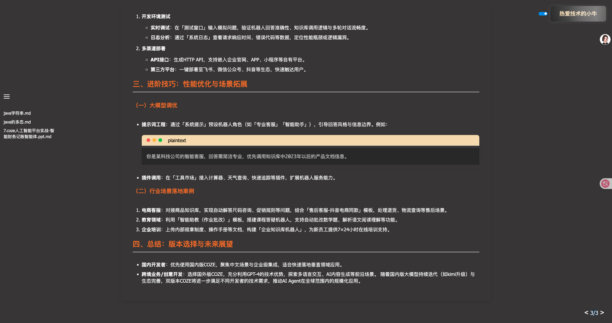
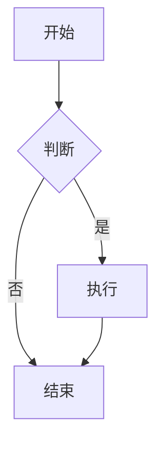
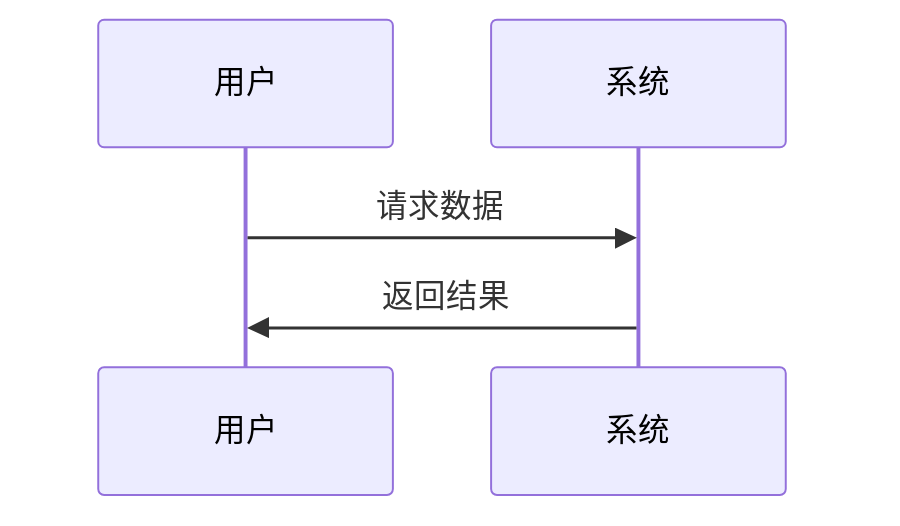

# Markdown 幻灯片播放平台

## 项目简介
本项目是一个基于 Flask 的 Markdown 幻灯片播放平台，支持 Markdown 文件的展示、幻灯片导航、主题切换，同时支持 Mermaid 图表和 MathJax 数学公式渲染，还提供了文件上传接口。

## 技术栈
- **后端**：Flask
- **前端**：HTML、CSS、JavaScript
- **Markdown 解析**：marked.js
- **图表渲染**：Mermaid
- **数学公式渲染**：MathJax
- **代码高亮**：Prism.js

## 项目结构
```
slideshow-platform_dev/
├── app.py
├── favicon.ico
├── images/                    # 图片存放目录
│   └── README.md
├── slides/
│   ├── go/
│   ├── java/
│   ├── python/
│   ├── list.json
│   └── ...
├── static/
│   ├── css/
│   │   ├── prism-tomorrow.min.css
│   │   └── styles.css
│   └── js/
│       ├── app.js
│       ├── main.js
│       └── ...
└── templates/
    ├── 404.html
    └── index.html
```

## 功能特性
1. **Markdown 幻灯片展示**：支持从 `slides` 目录下加载 Markdown 文件并渲染为幻灯片。
2. **侧边栏目录导航**：左侧可折叠的侧边栏显示所有幻灯片列表，点击可快速跳转。
3. **主题切换**：在 logo 左侧有主题切换开关，可切换深色和浅色主题。
4. **多种导航方式**：
   - 底部导航按钮：上一页、下一页按钮和幻灯片计数器
   - 键盘导航：支持左右箭头键翻页
   - 侧边栏目录：点击目录项直接跳转
5. **文件上传**：支持通过 `/upload/<path:keyword>` 接口上传 Markdown 文件。
6. **图片支持**：支持在 Markdown 文件中插入图片，图片存放在 `images/` 目录中。
7. **代码高亮**：支持多种编程语言的语法高亮，采用苹果风格的代码块设计。
8. **图表渲染**：支持 Mermaid 图表渲染，可绘制流程图、时序图等。
9. **数学公式**：支持 MathJax 数学公式渲染。
10. **动画效果**：幻灯片切换时的平滑过渡动画，按钮的弹跳动画效果。
11. **响应式设计**：适配不同屏幕尺寸，支持移动端访问。




## 安装与运行
### 安装依赖
项目使用 Python 和 Flask，确保你已经安装 Python 3.x，然后运行以下命令安装依赖：
```bash
pip install flask
```
### 运行项目
在项目根目录下运行以下命令启动 Flask 应用：
```bash
python app.py
```
应用将在 `http://127.0.0.1:5001` 启动。

## 使用方法
### 浏览幻灯片
- 访问 `http://127.0.0.1:5001` 或 `http://127.0.0.1:5001/slides` 浏览默认幻灯片。
- 访问 `http://127.0.0.1:5001/slides/<目录名>` 浏览指定目录下的幻灯片。

### 导航操作
1. **侧边栏导航**：
   - 点击左上角的汉堡菜单按钮（三条横线）显示/隐藏侧边栏
   - 侧边栏显示当前目录下的所有幻灯片列表
   - 点击任意幻灯片标题可直接跳转到该幻灯片

2. **底部导航**：
   - 使用 `<` 和 `>` 按钮进行上一页/下一页操作
   - 中间的计数器显示当前页码和总页数

3. **键盘导航**：
   - 按 `←` 左箭头键：上一页
   - 按 `→` 右箭头键：下一页

4. **主题切换**：
   - 点击 logo 左侧的开关切换深色/浅色主题

### 上传 Markdown 文件
使用 POST 请求访问 `/upload/<path:keyword>` 接口上传 Markdown 文件：
```bash
curl -X POST -F "file=@your_file.md" http://127.0.0.1:5001/upload/<keyword>
```
其中 `<keyword>` 对应 `slides` 目录下的子目录名。

### 使用图片
1. 将图片文件放入 `images/` 目录
2. 在 Markdown 文件中使用以下语法插入图片：
```markdown

```
3. 支持的图片格式：PNG、JPEG、GIF、SVG、WebP

#### 图片使用示例
```markdown
# 幻灯片标题

这是一张示例图片：


图片会自动适应幻灯片大小并保持比例。
```

### 代码高亮
支持多种编程语言的语法高亮，采用苹果风格的代码块设计：

```markdown
# Python 代码示例
```python
def hello_world():
    print("Hello, World!")
    return "Success"
```

# JavaScript 代码示例
```javascript
function greet(name) {
    return `Hello, ${name}!`;
}
```
```

### Mermaid 图表
支持绘制各种类型的图表：

```markdown
# 流程图


# 时序图

```

### MathJax 数学公式
支持 LaTeX 格式的数学公式：

```markdown
# 行内公式
这是一个行内公式：$E = mc^2$

# 块级公式
$$
\int_{-\infty}^{\infty} e^{-x^2} dx = \sqrt{\pi}
$$
```


## 注意事项
- 确保 `slides` 目录下的每个子目录都有 `list.json` 文件，用于记录该目录下的 Markdown 文件列表。
- 上传的文件必须是 `.md` 格式。
- 图片文件建议压缩后上传，以提高加载速度。
- Mermaid 图表需要正确的语法格式，错误语法会显示错误信息。
- MathJax 数学公式使用 LaTeX 语法，确保公式格式正确。
- 代码高亮支持多种语言，在代码块开头指定语言类型即可。
- 侧边栏默认隐藏，点击汉堡菜单按钮显示/隐藏。
